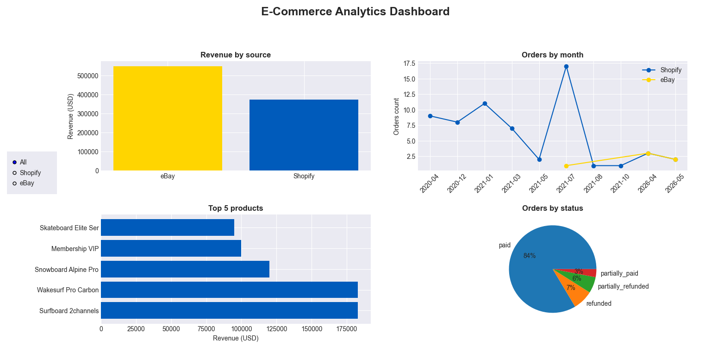

# E-Commerce Analytics Project
### ReDI School Munich — Python Course Final Project 2026

## Project Description
This project integrates data from two e-commerce platforms (Shopify and eBay), maps them into a unified SQLite database, calculates key business metrics (KPIs) using SQL queries, and visualizes the results with an interactive Matplotlib dashboard with source filter.

## Project Structure
Final_Project_Python/
  main.py              - runs the full pipeline
  etl.py               - Extract, Transform, Load
  db.py                - database structure and validation
  analytics.py         - SQL queries and KPIs
  charts.py            - Matplotlib dashboard with source filter
  test_db_etl.py       - unit tests
  requirements.txt     - project dependencies
  Shopify_05_26.txt    - Shopify data (JSON)
  Ebay_26_05_26.txt    - eBay data (JSON)
  Mapping.xlsx         - data mapping documentation
  screenshot.png       - dashboard screenshot

## Database Schema
Table - Description
EcomOrders - All orders from both platforms
EcomOrderDetails - Order line items
EcomProducts - Products from both platforms
EcomTransactions - Payment transactions

## KPIs
- Total revenue by source (Shopify vs eBay)
- Orders count and revenue by month (split by source)
- Top-5 products by revenue (split by source)
- Orders by financial status (split by source)
- Total summary: orders count, revenue, average order value and items sold by source

## Dashboard
Interactive dashboard built with Matplotlib.
Use RadioButtons filter on the left to switch between All, Shopify and eBay data.

## Screenshots


## Future Improvements
- Add date range filter
- Add category filter
- Currency normalization to USD
- Store historical data with loaded_at timestamp
- Add total summary chart to dashboard
- Interactive dashboard using Plotly Dash

## How to Run

1. Clone the repository:
```bash
git clone https://github.com/NNadiia/Final_Project_Python.git
cd Final_Project_Python
```

2. Create and activate virtual environment:
```bash
python -m venv ecommerce_venv
ecommerce_venv\Scripts\activate
```

3. Install dependencies:
```bash
pip install -r requirements.txt
```

4. Run the project:
```bash
python main.py
```

## Technologies
- Python 3.14
- SQLite3 (built-in)
- Matplotlib
- json (built-in)
- uuid (built-in)
- pathlib (built-in)

## Resources Used
- [Python SQLite3 Documentation](https://docs.python.org/3/library/sqlite3.html)
- [Matplotlib Documentation](https://matplotlib.org/stable/index.html)
- [Pathlib Documentation](https://docs.python.org/3/library/pathlib.html)
- [Pytest Documentation](https://docs.pytest.org/)


## Troubleshooting
- **ModuleNotFoundError** — run `pip install -r requirements.txt`
- **FileNotFoundError** — make sure JSON files are in the same folder as main.py
- **ecommerce.db errors** — delete ecommerce.db and run again

## AI Tools Usage
Claude AI, Chat GPT was used to support development:
- Debugging and error fixing
- Code explanations and learning
- Сode was written following AI explanations and guidance

## Author
Nadiia — ReDI School Munich, Python Course 2026